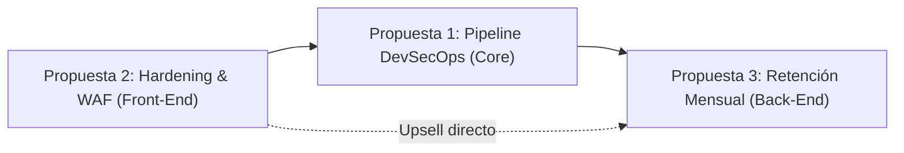

# Plan Estratégico y Operativo: DevOps, Hardening Web & Seguridad Digital

Este documento establece la base estratégica, operativa y financiera para la transición de un modelo de servicios genéricos de publicidad y páginas web hacia una oferta de alto valor y margen en **Infraestructura Cloud, Seguridad Web (WebSec) y Operaciones Continuas (DevSecOps)**.

---

## 1. Diagnóstico de Mercado y Sustento en Datos Oficiales

La decisión de pivotar el modelo de negocio responde a disparidades estructurales de mercado, rentabilidad y tratamiento fiscal en Colombia y la región:

```
+------------------------------------+         +------------------------------------+
|  Modelo Tradicional (Marketing)    |         |  Nuevo Modelo (DevOps & WebSec)    |
+------------------------------------+         +------------------------------------+
| - Margen bruto comprimido (ads)    |         | - Alto valor agregado (DANE)       |
| - Gasto prescindible / alta rotación|        | - Misión crítica (continuidad)     |
| - Gravado con 19% IVA (DIAN)       |         | - Excluido de IVA 0% (E.T. 476#21) |
| - Alta saturación de agencias      |         | - Déficit de +60.000 profesionales |
+------------------------------------+         +------------------------------------+
```

### 1.1. DANE: Coeficiente de Valor Agregado y Resiliencia (EAS y EMS)
* **Clasificación CIIU:**
  * *CIIU 7310 (Publicidad):* En la Encuesta Anual de Servicios (EAS), el subsector publicitario presenta un alto porcentaje de consumo intermedio debido al costo de pauta e intermediación con plataformas multinacionales (Google, Meta). El margen neto de las agencias de intermediación se encuentra presionado y sufre alta elasticidad ante variaciones del PIB.
  * *CIIU 6201, 6202, 6311 (Programación, Consultoría Informática y Alojamiento/Cloud):* Presentan los coeficientes de **producción bruta y valor agregado más altos de la economía de servicios**. Al depender principalmente de propiedad intelectual y conocimiento especializado, el margen de contribución operativa supera el 60-70%.
* **Comportamiento del gasto empresarial:** En fases de ajuste macroeconómico, los presupuestos publicitarios son recortados de inmediato; la infraestructura tecnológica, los servidores y la continuidad operativa constituyen gastos fijos no negociables.

### 1.2. MinTIC, ColCERT y Gremio TI: Urgencia y Brecha de Talento
* **Ciberamenazas en Colombia:** De acuerdo con los balances técnicos del **ColCERT** (Centro Cibernético Nacional) y análisis de cámaras TIC (CCIT / Fortinet):
  * Colombia registra más de **10.000 millones de intentos de ciberataques al año**, ubicándose de forma persistente en el **Top 3 de América Latina**.
  * El **73% de las empresas colombianas** reportó al menos un incidente de seguridad digital significativo.
  * **Solo el 12% de las MiPyMEs** cuenta con políticas o planes formales de respuesta ante incidentes.
* **Déficit Estructural de Talento (MinTIC / Fedesoft):**
  * Colombia mantiene una brecha superior a **60.000 perfiles especializados** en software, nube y seguridad informática.
  * Las empresas no cuentan con el presupuesto ni el acceso para contratar un ingeniero DevOps o SecOps interno a tiempo completo (cuyo salario oscila entre \$7.000.000 y \$16.000.000 COP mensuales o \$2.000 - \$4.000 USD). La tercerización en esquemas de servicios empaquetados resuelve directamente esta restricción.

### 1.3. DIAN: Eficiencia Tributaria y Competitividad Comercial
* **Exclusión de IVA (Artículo 476, Numeral 21 del Estatuto Tributario):**
  * Por disposición legal, armonizada con el Decreto 1412 y los Conceptos Unificados de la DIAN (Concepto 017056 y Oficio 100208192-190 de 2024), **los servicios de computación en la nube (Cloud Computing), suministro de servidores (hosting) y plataformas web están EXCLUIDOS DE IVA (tarifa 0%)**.
  * La intermediación de publicidad y gestión de pauta tradicional está **gravada con el 19% de IVA**.
* **Impacto Comercial:** Al comercializar infraestructura, WAF y plataformas automatizadas, la factura al cliente corporativo no traslada un sobrecosto del 19%, mejorando el flujo de caja del cliente y otorgando una ventaja competitiva frente a agencias de marketing digital.

---

## 2. Análisis de Operación de las Tres Propuestas

La oferta se organiza en una arquitectura de tres módulos interconectados: un servicio ágil de entrada (Front-End), un proyecto de implementación de alto impacto (Core) y un contrato recurrente de soporte y monitoreo (Back-End).



---

### Propuesta A: Hardening Web, WAF & Rendimiento (Servicio de Entrada / Quick-Win)

* **Objetivo:** Blindar páginas web corporativas, portales de comercio electrónico y aplicaciones web frente a ciberataques comunes y lentitud en tiempo de carga.
* **Stack Tecnológico:** Cloudflare Pro/Business, Nginx/Caddy Hardening, Certbot/ACME (SSL estricto), Security Headers Engine, Redis/Fastcgi Cache.
* **Flujo Operativo (Paso a Paso):**
  1. *Auditoría Perimetral inicial (Día 1):* Escaneo de cabeceras, versión de TLS, exposición de puertos y análisis de velocidad (Core Web Vitals).
  2. *Migración DNS y Capa de Borde (Día 2):* Activación de Cloudflare con DNSSEC y reglas de protección anti-DDoS.
  3. *Reglas de WAF y Mitigación (Día 3):* Configuración de rate limiting (límite de peticiones), bloqueo de scraping malicioso, filtrado por país y bloqueo de inyecciones SQL/XSS en endpoints vulnerables.
  4. *Hardening de Servidor y Cabeceras (Días 4-5):* Configuración de CSP (Content Security Policy), HSTS estricto, desactivación de cifrados débiles y aislamiento de rutas administrativas mediante Zero Trust / Access.
* **Entregables:**
  * Reporte de seguridad pre/post intervención.
  * Certificación de cabeceras A+ (SecurityHeaders.com) y SSL A+ (SSL Labs).
  * Panel de métricas de amenazas bloqueadas.
* **Horas de dedicación técnica:** 8 a 12 horas por cliente.

---

### Propuesta B: Pipeline DevSecOps & Automatización CI/CD (Proyecto Principal)

* **Objetivo:** Automatizar la entrega continua de software integrando pruebas de seguridad estáticas y dinámicas dentro del ciclo de desarrollo del cliente.
* **Stack Tecnológico:** GitHub Actions / GitLab CI, Docker, TruffleHog / GitGuardian, Trivy, SonarQube / Semgrep, Terraform, AWS (ECS/EC2) o VPS dedicados (Hetzner / DigitalOcean / Coolify).
* **Flujo Operativo:**
  1. *Evaluación de Repositorio y Arquitectura (Semana 1):* Mapeo de flujos de despliegue actuales, dependencias del proyecto e infraestructura destino.
  2. *Detección de Secretos y Hardening de Repositorio (Semana 1):* Auditoría de historial de commits con TruffleHog para purgar credenciales quemadas; protección de ramas (`main`/`staging`) con firmas y aprobaciones requeridas.
  3. *Construcción del Pipeline CI/CD Seguro (Semana 2):*
     * *Etapa Build & Test:* Automatización de pruebas unitarias.
     * *Etapa SAST & Dependencias:* Escaneo automático de código y paquetes vulnerables (SCA).
     * *Etapa Container Security:* Construcción de imágenes Docker mínimas (Alpine/Distroless) y escaneo de vulnerabilidades con Trivy.
  4. *Despliegue Cero-Caídas (Zero-Downtime) (Semana 3):* Implementación de despliegues automatizados hacia Staging y Producción (Rolling / Blue-Green) y notificaciones de estado en Slack o Discord.
* **Entregables:**
  * Archivos de flujo de trabajo YAML documentados y versionados.
  * Manual de operación técnica y buenas prácticas para el equipo de desarrollo.
  * Sesión de transferencia de conocimiento de 2 horas.
* **Horas de dedicación técnica:** 25 a 35 horas por implementación.

---

### Propuesta C: DevOps & Security On-Demand (Retención Mensual / SLA)

* **Objetivo:** Proveer tranquilidad técnica y continuidad de negocio mediante la administración preventiva de servidores, respuesta a fallos y optimización periódica.
* **Stack Tecnológico:** Uptime Kuma / BetterStack, Grafana Cloud / Prometheus, BorgBackup / Restic, Ansible, Wazuh / CrowdSec.
* **Flujo Operativo Recurrente:**
  * *Diario / Tiempo Real:* Monitoreo automatizado de disponibilidad 24/7 y detección de anomalías de consumo (CPU, RAM, Disco, Ancho de banda).
  * *Semanal:* Verificación de respaldos (Backups) automatizados y comprobación de integridad fuera del servidor principal (Off-site storage).
  * *Mensual:* Aplicación de parches de seguridad del sistema operativo, actualización de dependencias críticas, reporte ejecutivo de incidentes y banco de horas de soporte (5 a 10 horas/mes).
* **Horas de dedicación técnica:** 4 a 6 horas operativas promedio por cliente/mes (alta eficiencia gracias a la automatización de alertas).

---

## 3. Proyección Financiera a 5 Años

> **Supuestos del modelo:**
> * Moneda base: **USD** (tarifas estandarizadas para clientes locales y remotos).
> * Año 1: Fase de validación, transición de clientes y estandarización de procesos.
> * Años 2-5: Maduración comercial, incorporación de personal junior y retención acumulativa de contratos mensuales (MRR).

### 3.1. Supuestos de Precios Promedio
* **Propuesta A (Hardening Web):** \$850 USD (pago único).
* **Propuesta B (Pipeline DevSecOps):** \$2.800 USD (pago único).
* **Propuesta C (Retención Mensual):** \$800 USD/mes por cliente recurrente promedio (\$9.600 USD/año).
* Tasa de conversión de proyectos únicos (A y B) hacia retención mensual (C): **40%**.

### 3.2. Proyección de Ventas e Ingresos Anuales

| Indicador / Año | Año 1 | Año 2 | Año 3 | Año 4 | Año 5 |
| :--- | :---: | :---: | :---: | :---: | :---: |
| **Proyectos Hardening (A)** | 14 | 22 | 30 | 36 | 40 |
| **Ingresos Propuesta A** | \$11.900 | \$18.700 | \$25.500 | \$30.600 | \$34.000 |
| **Proyectos DevSecOps (B)** | 8 | 15 | 22 | 28 | 34 |
| **Ingresos Propuesta B** | \$22.400 | \$42.000 | \$61.600 | \$78.400 | \$95.200 |
| **Clientes Activos Retención (C)** | 6 | 16 | 28 | 42 | 58 |
| **Ingresos Retención C (ARR)** | \$38.400 | \$115.200 | \$215.040 | \$338.688 | \$483.840 |
| **Ingresos Totales Brutos** | **\$72.700** | **\$175.900** | **\$302.140** | **\$447.688** | **\$613.040** |
| **Costo Operativo Estimado (COGS + OpEx)** | \$18.200 | \$48.000 | \$95.000 | \$155.000 | \$215.000 |
| **EBITDA Estimado** | **\$54.500** | **\$127.900** | **\$207.140** | **\$292.688** | **\$398.040** |
| **Margen EBITDA (%)** | **75.0%** | **72.7%** | **68.6%** | **65.4%** | **64.9%** |

*Nota sobre márgenes:* En los años 3 al 5, el margen se ajusta levemente del 75% al 65% debido a la contratación de ingenieros de soporte para delegar la guardia y mantener el SLA sin saturación del fundador.

---

## 4. Tabla de Inversión Inicial (Setup de la Startup Proveedora)

Para poner en marcha esta unidad de negocio y comercializar las tres propuestas, los requerimientos de capital son sustancialmente bajos, dado que el apalancamiento se basa en herramientas Open Source y software en la nube.

| Concepto de Inversión | Descripción / Herramienta | Costo Mensual (USD) | Inversión Año 1 (USD) | Propósito Operativo |
| :--- | :--- | :---: | :---: | :--- |
| **Infraestructura de Monitoreo Central** | VPS Hetzner / DigitalOcean (Uptime Kuma, Grafana, Alertmanager) | \$25 | \$300 | Monitorear todos los clientes desde un panel unificado propio. |
| **Suite de Pruebas & Hardening** | Suscripción Cloudflare Pro (cuenta demo), licencias de escaneo y dominios de testing | \$40 | \$480 | Entorno de homologación y validación de reglas WAF. |
| **Seguridad de Repositorios** | Cuentas profesionales GitHub / GitLab + TruffleHog Enterprise demo / Snyk | \$30 | \$360 | Integración y pruebas de pipelines CI/CD automatizados. |
| **Identidad & Landing Técnica** | Dominio .com/.io, hosting cloudflare pages, email corporativo Workspace | \$15 | \$180 | Posicionamiento como firma de ingeniería de alta confianza. |
| **Prospección & Ventas B2B** | LinkedIn Sales Navigator / Herramienta de enriquecimiento B2B (Apollo.io) | \$80 | \$960 | Captación directa de Founders, CTOs y Directores de Tecnología. |
| **Legal y Formalización** | Asesoría contractual (contrato de confidencialidad NDA y SLA en Colombia) | Pago único | \$400 | Blindaje de responsabilidad sobre datos y continuidad de clientes. |
| **TOTAL INVERSIÓN ESTIMADA (Año 1)** | — | **\$190 / mes** | **\$2.680 USD** | Retorno de inversión cubierto con la venta de **1 proyecto DevSecOps** o **3 proyectos de Hardening**. |

---

## 5. Hoja de Ruta de Ejecución Inmediata (Próximos 30 Días)

```
[Semana 1] --> Creación de Plantillas Maestras (GitHub Actions YAML + Cloudflare WAF presets)
[Semana 2] --> Despliegue de la Landing Page Técnica y Contratos Legales (SLA & NDA)
[Semana 3] --> Campaña de Prospección B2B: Auditorías de Seguridad Express a 30 Startups/PyMEs
[Semana 4] --> Cierre de los 2 primeros clientes piloto con descuento a cambio de testimonio
```
